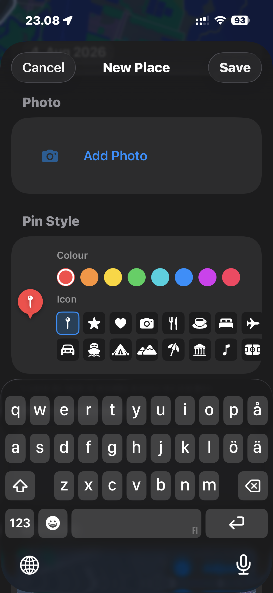
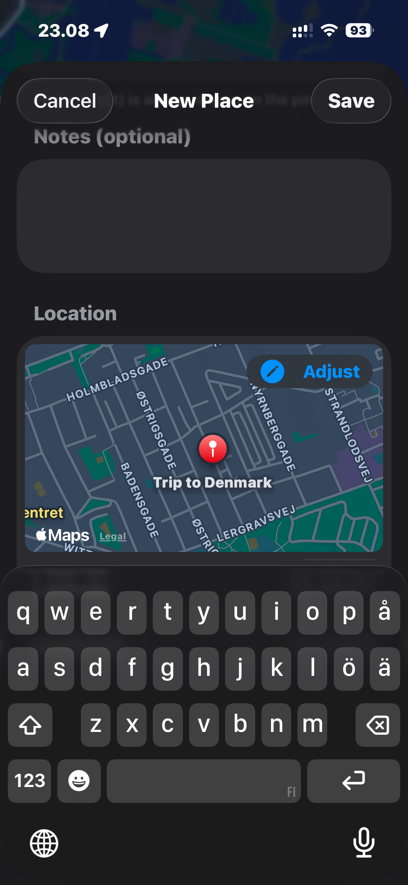
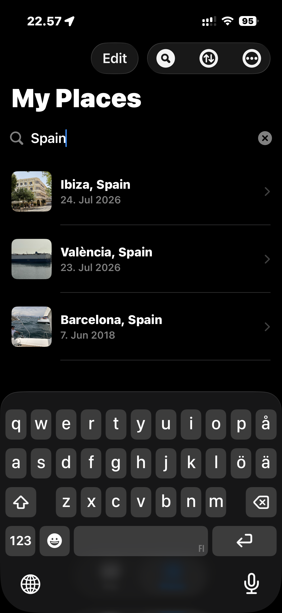
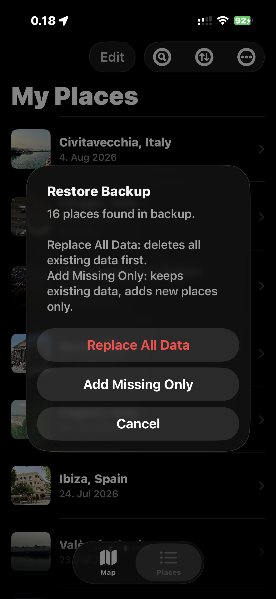

# iOS Travel Map — User Guide

Keep track of every place you've visited. Add locations manually on the map, import them from your photo albums, or discover them from your entire photo library — then browse, edit, and back up your travel history.

---

## Table of Contents

1. [First Launch](#1-first-launch)
2. [Map Tab](#2-map-tab)
3. [Add / Edit Place Sheet](#3-add--edit-place-sheet)
4. [Place Detail](#4-place-detail)
5. [Places Tab](#5-places-tab)
6. [The ⋯ Menu](#6-the--menu)
7. [Adding Places from Your Photos](#7-adding-places-from-your-photos)
   - 7.1 [Get Locations from Shared Photo Albums](#71-get-locations-from-shared-photo-albums)
   - 7.2 [Explore Photos on Map](#72-explore-photos-on-map)
8. [Backup & Restore](#8-backup--restore)
9. [iCloud Sync](#9-icloud-sync)
10. [Tips](#10-tips)
11. [About](#11-about)

---

## 1. First Launch

When you open the app for the first time:

- **Location access** — the app asks for permission to use your location. Allow it so the map can centre on where you are. You can still use the app without this.
- **Two tabs** appear — **Map** and **Places** — at the bottom of the screen on iPhone, or at the top on iPad.

---

## 2. Map Tab

The Map tab shows a full-screen map with custom pins marking all your saved places.

### Change the map style

Tap the small **map style button** in the bottom-left corner of the map. Three tiles appear — tap **Standard**, **Hybrid**, or **Satellite** to switch. Tap the button again to collapse the picker. Your choice is remembered.

### Zoom to fit all places
Tap the **pin icon** (top-left toolbar button) to zoom the map out so all your saved places are visible at once.

### Search for a location

Tap the **🔍 search button** in the toolbar to reveal the search bar. Type a city or place name and select a result — the add sheet opens with the name and coordinates pre-filled.

Tap the search button again (or tap ✕) to hide the search bar.

### Add a place by dropping a pin

1. Tap **+** in the top-right toolbar. An orange crosshair appears in the centre of the map.
2. Pan and zoom the map until the crosshair is over the location you want to add.
3. Tap **Place here**. The app reverse-geocodes the coordinates and pre-fills the trip name as *City, Country*.
4. Edit the name, date, photo, and notes if needed.
5. Tap **Save**.

### View or edit a saved place
Tap any pin on the map to open the place detail sheet. When you close the detail, the map returns to exactly the position and zoom level it was at before you opened it.

---

## 3. Add / Edit Place Sheet

A form sheet for creating or editing a place record.

| Field | Details |
|---|---|
| Trip Name | Free-text, required. Pre-filled from geocoding or search as *City, Country*. Can be changed to any custom name (e.g. "Mediterranean trip"). |
| City | Optional. Auto-filled from GPS — edit if needed or leave blank. |
| Country | Optional. Auto-filled from GPS — edit if needed or leave blank. |
| Date Visited | Date picker, defaults to today. |
| Photo | Optional. Chosen from the photo library. |
| Pin Style | Pick a colour (8 swatches) and an icon (16 symbols). A live preview shows how your pin will look on the map. If a photo is set, the photo is always shown on the pin. |
| Notes | Optional multi-line text. |
| Location preview | Embedded mini-map. Tap **Adjust** to fine-tune the pin position. |

### Adjust the location
Tap **Adjust** below the location preview map. An orange crosshair appears — pan the map to the precise position, then tap **Use this location** to confirm.

---

## 4. Place Detail

Tapping a place (from the map or the list) opens a detail sheet showing:

- Place name, date visited, and GPS coordinates
- A mini-map centred on the location — **tap the mini-map** to jump to that place on the main Map tab
- Notes (if any were added)
- A photo (if one was added)

Tap **Edit** to open the edit form, or **Delete Place** at the bottom to remove it.

When you close the detail sheet, the map automatically returns to the position and zoom level it had before you opened it.

---

## 5. Places Tab

The Places tab shows a list of all your saved places. Each row shows the trip name, city/country (if set), date, and notes snippet.

### Search the list

Tap the **🔍 search button** in the toolbar to reveal an inline search bar.

Type to filter by trip name, city, country, or notes. Tap the button again to hide the search bar and clear the filter.

### Sort the list

Tap the **sort button** (↑↓ circle icon) in the toolbar and choose from:
- **Date (newest first)** — default
- **Date (oldest first)**
- **Name (A → Z)**
- **Name (Z → A)**
- **City (A → Z)**
- **City (Z → A)**
- **Country (A → Z)**
- **Country (Z → A)**

### Delete a place
Swipe left on any row and tap **Delete**.

---

## 6. The ⋯ Menu

Tap **⋯** in the top-right toolbar of the Places tab to access:

- **Export Backup** — save all your places to a ZIP file
- **Import Backup** — restore from a ZIP backup
- **Get Locations from Shared Photo Albums** — import places from an iCloud Shared Album
- **Explore Photos on Map** — browse your entire photo library on a map
- **Help / User Guide** — opens this guide in Safari
- **About** — shows app version, build date, and copyright information

---

## 7. Adding Places from Your Photos

There are two ways to bring in locations from your iOS photo library.

---

### 7.1 Get Locations from Shared Photo Albums

Use this to import visited places from a specific iCloud Shared Album.

1. Tap **⋯ → Get Locations from Shared Photo Albums**.
2. The app asks for photo library access — tap **Allow**.
3. A list of your iCloud Shared Albums appears. Use the **search bar** at the top to filter albums by name if you have many. Tap the album you want to scan.
4. The app groups geotagged photos by geographic area and reverse-geocodes each group to a *City, Country* name. This takes a few seconds.

5. A list of detected locations appears. Locations you have already saved are marked **Already in your places** and cannot be selected again.
6. Tick any new locations you want to add, then tap **Add N places**.
7. To change the representative photo for a location, tap its thumbnail — a photo picker opens showing all photos from that area.

#### Clustering radius
At the top of the album list, a segmented control lets you choose how far apart photos must be to be treated as separate locations:

| Radius | Best for |
|--------|----------|
| **10 km** | City breaks — keeps nearby neighbourhoods separate |
| **20 km** | Short regional trips |
| **50 km** | Default — works well for most holidays |
| **100 km** | Long road trips or wide country tours |

---

### 7.2 Explore Photos on Map

Use this to browse all geotagged photos from your entire photo library on a map and pick places to save.

1. Tap **⋯ → Explore Photos on Map**.
2. The app requests photo library access if not already granted.
3. The map appears almost immediately, showing **orange camera pins** — one per geographic area.
4. Use the **clustering radius picker** at the top of the map to control how photos are grouped — choose **10 km**, **20 km**, **50 km**, or **100 km**. Changing the radius rescans your library automatically and your choice is remembered for next time.
5. Tap any pin to open a detail sheet.

6. The detail sheet shows the location name, how many photos were taken there, the earliest date, and a thumbnail.
7. Tap the **thumbnail** to browse all photos from that area and choose a different one.
8. Tap **Add to My Places** to save the location.
9. Tap **Close** (top-left) at any time to cancel and dismiss.

---

## 8. Backup & Restore

Back up all your places (including photos) to a single ZIP file you can store anywhere.

### Export a backup

1. Tap **⋯ → Export Backup**.
2. The system Share Sheet appears. Save the ZIP to Files, send via AirDrop, email it, or store it anywhere you like.

The backup file is named `iOS-Travel-Map_YYYY-MM-DD_HHmmss.zip`.

### Restore from a backup

1. Tap **⋯ → Import Backup**.
2. Browse to your `.zip` backup file and tap it.

3. A dialog shows how many places were found in the backup. Choose:
   - **Replace All Data** — deletes everything currently in the app, then imports all places from the backup. Use this to fully restore.
   - **Add Missing Only** — keeps your existing places and only adds places not already present. Use this to merge two devices.
   - **Cancel** — cancels import without making any changes.

---

## 9. iCloud Sync

Your places sync automatically across all your Apple devices signed into the same iCloud account — iPhone, iPad, and Mac. No setup needed. Changes appear on other devices within a few seconds.

---

## 10. Tips

- **Large photo library?** Explore Photos on Map handles tens of thousands of photos — it clusters them into city-level pins so the map stays fast and easy to use. Adjust the clustering radius at the top of the map to control how broadly photos are grouped.
- **Same city, many photos?** Both import features cluster nearby photos into a single place entry. Use a smaller radius for dense city trips, larger for road trips.
- **Custom pins** — open any place in Edit to change its pin colour and icon. If you assign a photo to a place, the photo thumbnail is shown on the map instead.
- **Jump to a place on the map** — from the Places tab, tap a place to open its detail, then tap the mini-map to switch to the Map tab centred on that place. When you close the detail, the map returns to where you were.
- **Changed your mind about a photo?** Tap a saved place → Edit, then tap the photo thumbnail to pick a new one from your library.
- **Moved to a new phone?** Export a backup on the old phone, AirDrop the ZIP to the new phone, then Import Backup → Replace All Data. All your places, photos, and pin styles will be there.

---

## 11. About

The About screen shows key information about this version of the app:

- **Version & build number** — e.g. *1.1 (build 3)*
- **Built** — the date and time this version was compiled
- **Copyright** — © 2026 Jukka Ruponen. All rights reserved.
- A **Help / User Guide** button linking to this guide

Access it via **⋯ → About** in the Places tab.

---

© 2026 Jukka Ruponen. All rights reserved.
