# iOS Travel Map — User Guide

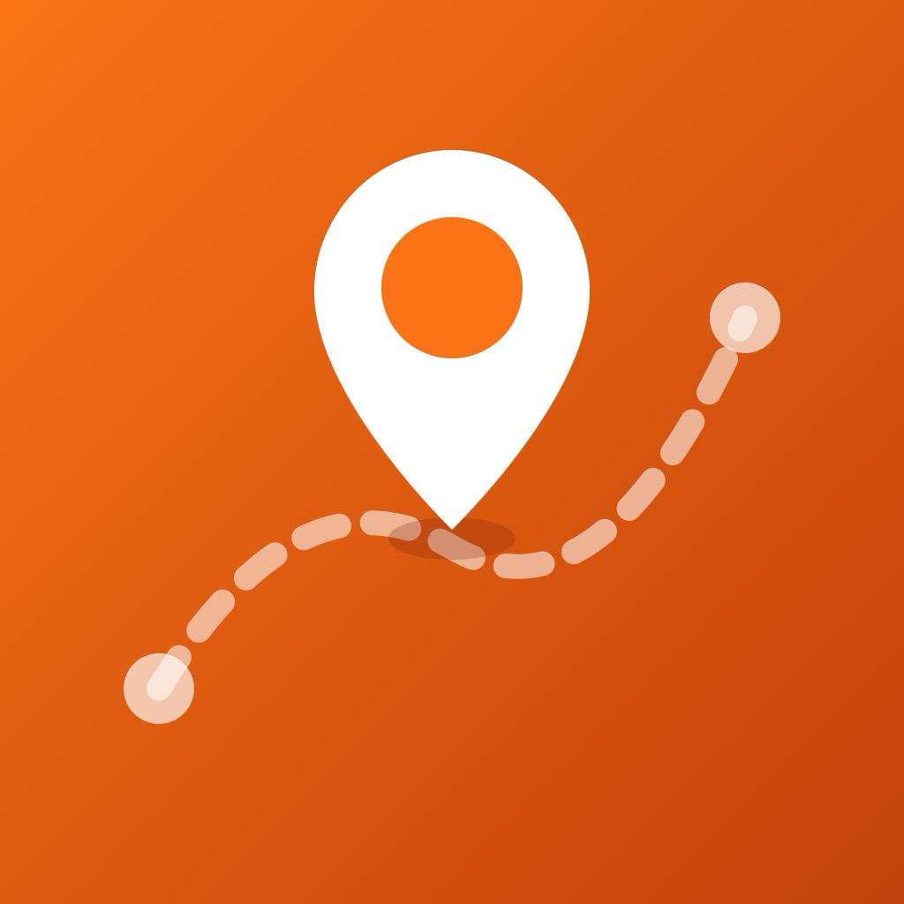

Keep track of every place you've visited. Add locations manually on the map, import them from your photo albums, or discover them from your entire photo library — then browse, edit, and back up your travel history.

---

## Table of Contents

1. [First Launch](#1-first-launch)
2. [Map Tab](#2-map-tab)
3. [Add / Edit Place Sheet](#3-add--edit-place-sheet)
4. [Place Detail](#4-place-detail)
5. [Places Tab](#5-places-tab)
6. [The ⋯ Menu](#6-the--menu)
7. [Adding Places from Your Photos](#7-adding-places-from-your-photos)
   - 7.1 [Get Locations from Shared Photo Albums](#71-get-locations-from-shared-photo-albums)
   - 7.2 [Explore Photos on Map](#72-explore-photos-on-map)
8. [Backup & Restore](#8-backup--restore)
9. [iCloud Sync](#9-icloud-sync)
10. [Tips](#10-tips)

---

## 1. First Launch

When you open the app for the first time:

- **Location access** — the app asks for permission to use your location. Allow it so the map can centre on where you are. You can still use the app without this.
- **Two tabs** appear at the bottom: **Map** and **Places**.

---

## 2. Map Tab

The Map tab shows a full-screen map with red pins marking all your saved places.

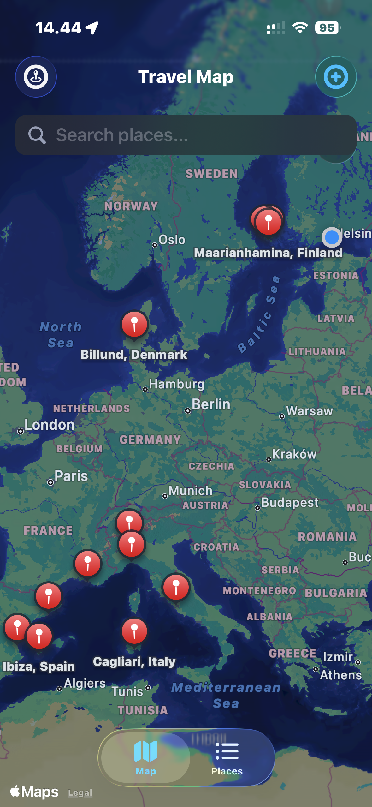

### Zoom to fit all places
Tap the **pin icon** (top-left toolbar button) to zoom the map out so all your saved places are visible at once.

### Add a place by dropping a pin

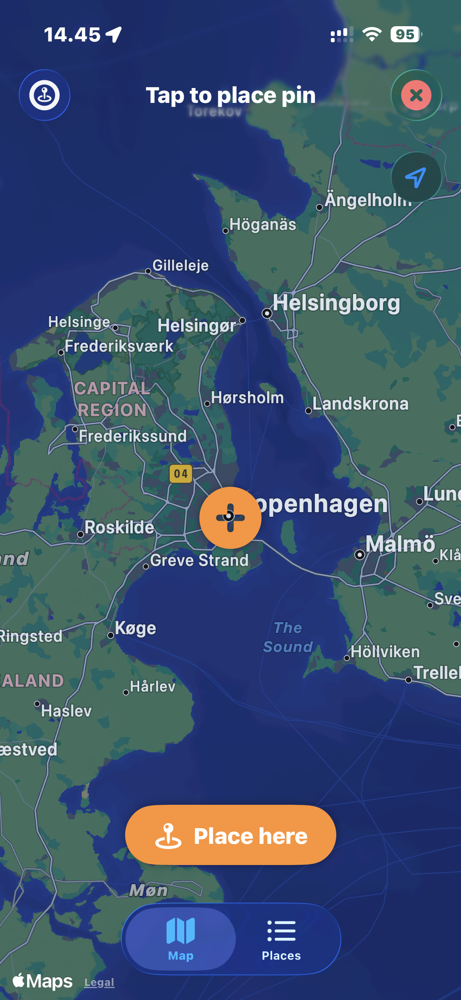

1. Tap **+** in the top-right toolbar. An orange crosshair appears in the centre of the map.
2. Pan and zoom the map until the crosshair is over the location you want to add.
3. Tap **Place here**. The app reverse-geocodes the coordinates and pre-fills the place name as *City, Country*.
4. Edit the name, date, photo, and notes if needed.
5. Tap **Save**.

### Add a place by searching

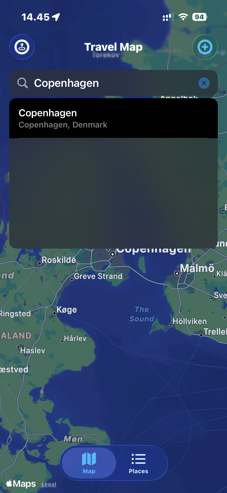

1. Tap the **search bar** at the top of the map and type a city or place name.
2. Select a result from the list. The add sheet opens with the name and coordinates already filled in.
3. Edit if needed, then tap **Save**.

### View or edit a saved place
Tap any red pin on the map to open the place detail sheet.

---

## 3. Add / Edit Place Sheet

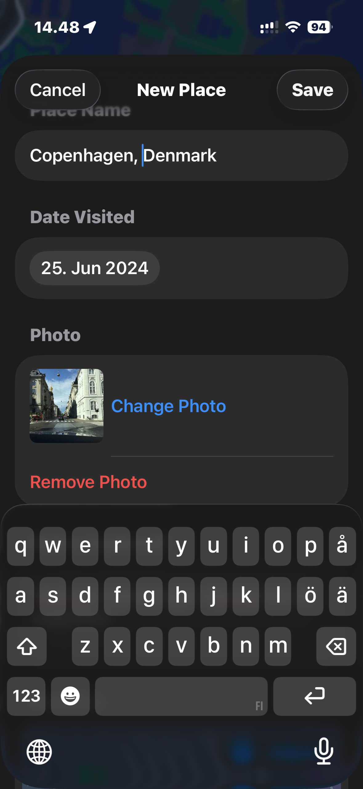

A form sheet for creating or editing a place record.

| Field | Details |
|---|---|
| Place Name | Free-text, required. Pre-filled from geocoding or search. |
| Date Visited | Date picker, defaults to today. |
| Photo | Optional. Chosen from the photo library. |
| Notes | Optional multi-line text. |
| Location preview | Embedded mini-map showing the pin. Tap **Adjust** to fine-tune the pin position. |

### Adjust the location
Tap **Adjust** below the location preview map. An orange crosshair appears — pan the map to the precise position, then tap **Use this location** to confirm.

---

## 4. Place Detail

Tapping a place (from the map or the list) opens a detail sheet showing:

- Place name, date visited, and GPS coordinates
- A mini-map centred on the location
- Notes (if any were added)
- A photo (if one was added)

Tap **Edit** to open the edit form, or **Delete Place** at the bottom to remove it.

---

## 5. Places Tab

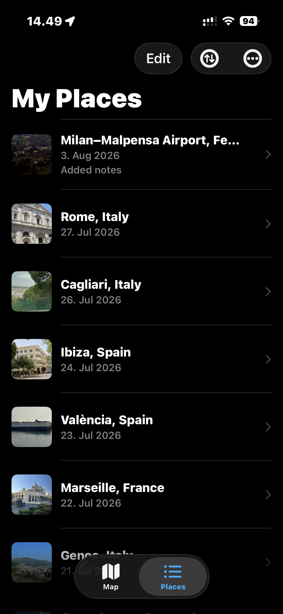

The Places tab shows a list of all your saved places.

### Sort the list

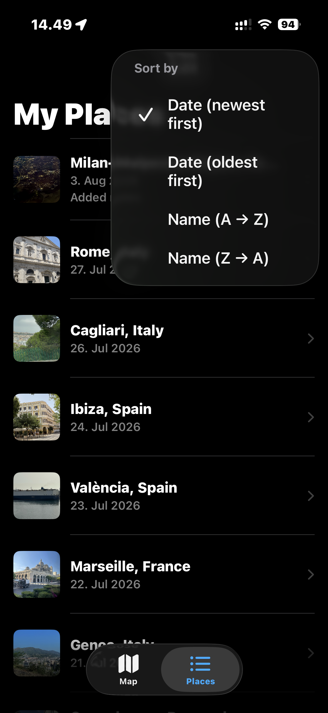

Tap the **sort button** (↑↓ circle icon) in the toolbar and choose from:
- **Date (newest first)** — default
- **Date (oldest first)**
- **Name (A → Z)**
- **Name (Z → A)**

### Delete a place
Swipe left on any row and tap **Delete**.

---

## 6. The ⋯ Menu

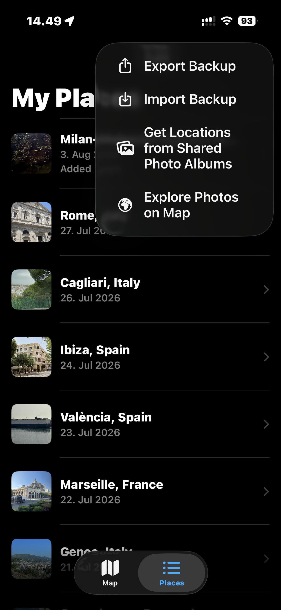

Tap **⋯** in the top-right toolbar of the Places tab to access:

- **Export Backup** — save all your places to a ZIP file
- **Import Backup** — restore from a ZIP backup
- **Get Locations from Shared Photo Albums** — import places from an iCloud Shared Album
- **Explore Photos on Map** — browse your entire photo library on a map

---

## 7. Adding Places from Your Photos

There are two ways to bring in locations from your iOS photo library.

---

### 7.1 Get Locations from Shared Photo Albums

Use this to import visited places from a specific iCloud Shared Album.

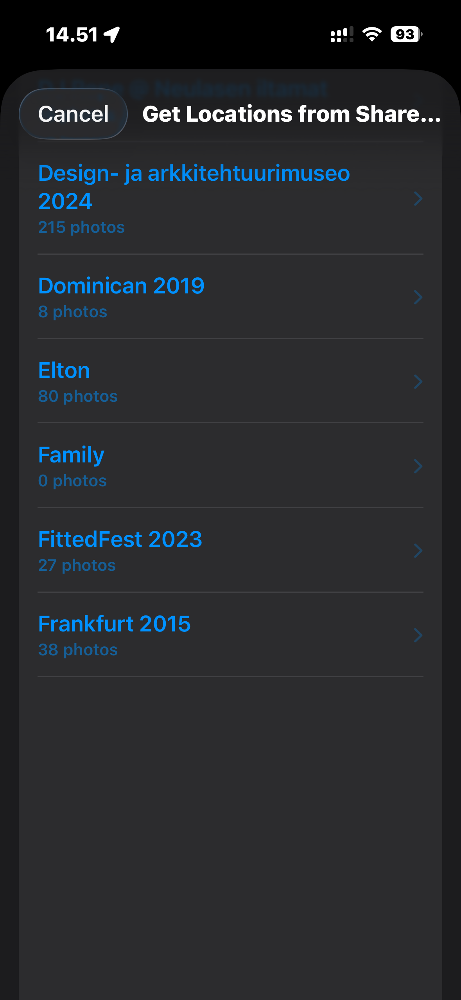

1. Tap **⋯ → Get Locations from Shared Photo Albums**.
2. The app asks for photo library access — tap **Allow**.
3. A list of your iCloud Shared Albums appears. Tap the one you want to scan.
4. The app groups geotagged photos by geographic area and reverse-geocodes each group to a *City, Country* name. This takes a few seconds.

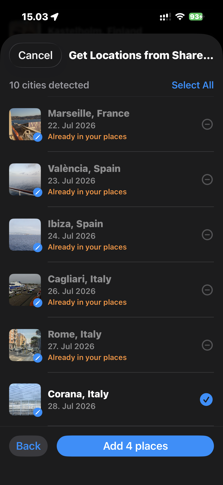

5. A list of detected locations appears. Locations you have already saved are marked **Already in your places** and cannot be selected again.
6. Tick any new locations you want to add, then tap **Add N places**.
7. To change the representative photo for a location, tap its thumbnail — a photo picker opens showing all photos from that area.

---

### 7.2 Explore Photos on Map

Use this to browse all geotagged photos from your entire photo library on a map and pick places to save.

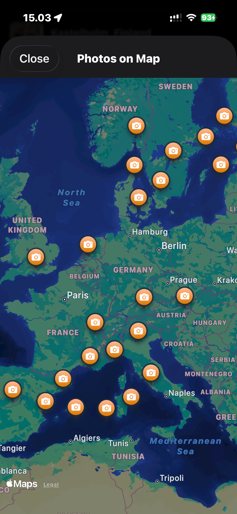

1. Tap **⋯ → Explore Photos on Map**.
2. The app requests photo library access if not already granted.
3. The map appears almost immediately, showing **orange camera pins** — one per geographic area.
4. Tap any pin to open a detail sheet.

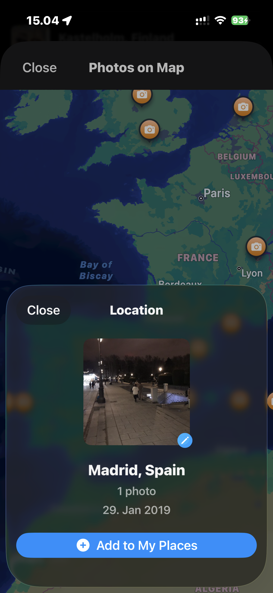

5. The detail sheet shows the location name, how many photos were taken there, the earliest date, and a thumbnail.
6. Tap the **thumbnail** to browse all photos from that area and choose a different one.
7. Tap **Add to My Places** to save the location.
8. Tap **Close** (top-left) at any time to cancel and dismiss.

---

## 8. Backup & Restore

Back up all your places (including photos) to a single ZIP file you can store anywhere.

### Export a backup

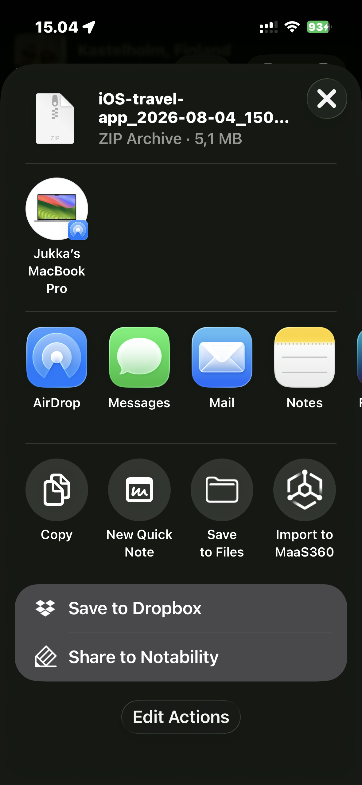

1. Tap **⋯ → Export Backup**.
2. The system Share Sheet appears. Save the ZIP to Files, send via AirDrop, email it, or store it anywhere you like.

The backup file is named `iOS-Travel-Map_YYYY-MM-DD_HHmmss.zip`.

### Restore from a backup

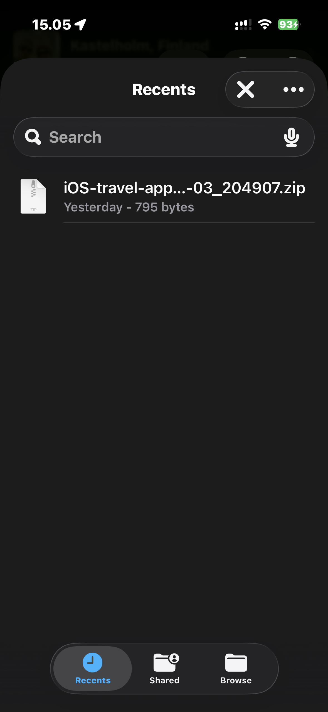

1. Tap **⋯ → Import Backup**.
2. Browse to your `.zip` backup file and tap it.
3. A dialog shows how many places were found in the backup. Choose:
   - **Replace All** — deletes everything currently in the app, then imports all places from the backup. Use this to fully restore.
   - **Add Missing Only** — keeps your existing places and only adds places not already present. Use this to merge two devices.
   - **Cancel** — does nothing.

---

## 9. iCloud Sync

Your places sync automatically across all your Apple devices signed into the same iCloud account — iPhone, iPad, and Mac. No setup needed. Changes appear on other devices within a few seconds.

---

## 10. Tips

- **Large photo library?** Explore Photos on Map handles tens of thousands of photos — it clusters them into city-level pins so the map stays fast and easy to use.
- **Same city, many photos?** Both import features cluster nearby photos into a single place entry. The Shared Album import lets you choose the clustering radius (10, 20, 50, or 100 km) — use a smaller radius for dense city trips, larger for road trips. Explore Photos on Map uses a fixed ~50 km grid.
- **Changed your mind about a photo?** Tap a saved place → Edit, then tap the photo thumbnail to pick a new one from your library.
- **Moved to a new phone?** Export a backup on the old phone, AirDrop the ZIP to the new phone, then Import Backup → Replace All. All your places and photos will be there.

---

© 2026 Jukka Ruponen. All rights reserved.
