# iOS Travel Map — User Guide

Keep track of every place you've visited. Add locations manually on the map, import them from your photo albums, or discover them from your entire photo library — then browse, edit, organise into trips, and back up your travel history.

---

## Table of Contents

1. [First Launch](#1-first-launch)
2. [Map Tab](#2-map-tab)
3. [Add / Edit Place Sheet](#3-add--edit-place-sheet)
4. [Place Detail](#4-place-detail)
5. [Places Tab](#5-places-tab)
6. [Trips Tab](#6-trips-tab)
7. [The ••• Menu](#7-the---menu)
8. [Adding Places from Your Photos](#8-adding-places-from-your-photos)
   - 8.1 [Add Places from Shared Album](#81-add-places-from-shared-album)
   - 8.2 [Explore Photos on Map](#82-explore-photos-on-map)
9. [Backup & Restore](#9-backup--restore)
10. [iCloud Sync](#10-icloud-sync)
11. [Tips](#11-tips)
12. [About](#12-about)

---

## 1. First Launch

When you open the app for the first time:

- **Location access** — the app asks for permission to use your location. Allow it so the map can centre on where you are. You can still use the app without this.
- **Three tabs** appear — **Map**, **Places**, and **Trips** — at the bottom of the screen on iPhone, or at the top on iPad.

---

## 2. Map Tab

The Map tab shows a full-screen map with custom pins marking all your saved places.

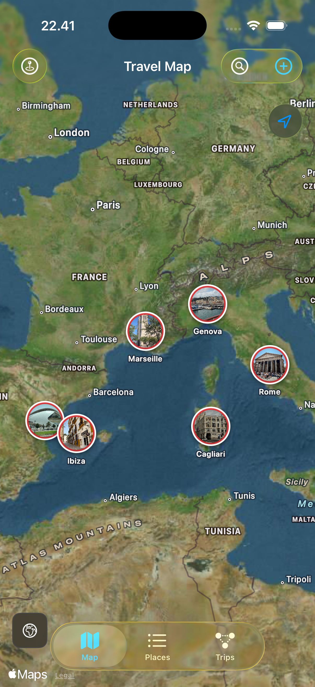

### Change the map style

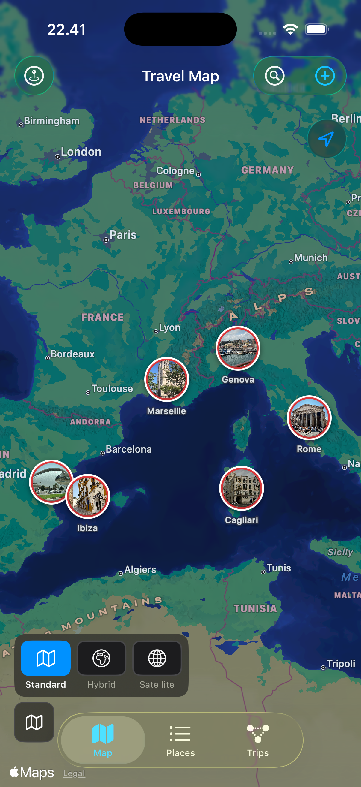

Tap the small **map style button** in the bottom-left corner of the map. Three tiles appear — tap **Standard**, **Hybrid**, or **Satellite** to switch. Tap the button again to collapse the picker. Your choice is remembered.

### Zoom to fit all places

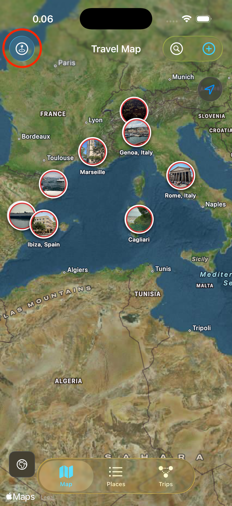

Tap the **pin icon** (top-left toolbar button, highlighted above) to zoom the map out so all your saved places are visible at once.

### Search for a location

Tap the **🔍 search button** in the toolbar to reveal the search bar. Type a city or place name and select a result — the add sheet opens with the name and coordinates pre-filled.

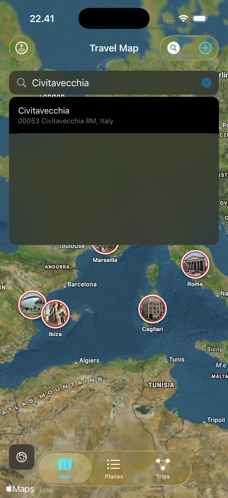

Tap the search button again (or tap ✕) to hide the search bar.

### Add a place by dropping a pin

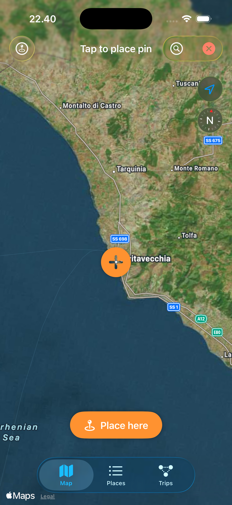

1. Tap **+** in the top-right toolbar. An orange crosshair appears in the centre of the map.
2. Pan and zoom the map until the crosshair is over the location you want to add.
3. Tap **Place here**. The app reverse-geocodes the coordinates and pre-fills the name as *City, Country*.
4. Edit the name, trip name, date, photo, and notes if needed.
5. Tap **Save**.

### View or edit a saved place
Tap any pin on the map to open the place detail sheet. When you close the detail, the map returns to exactly the position and zoom level it was at before you opened it.

---

## 3. Add / Edit Place Sheet

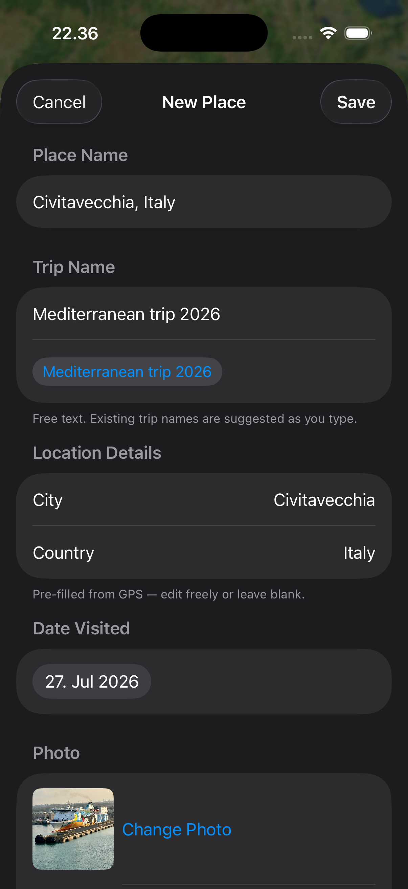

A form sheet for creating or editing a place record.

| Field | Details |
|---|---|
| Place Name | Free-text, required. Pre-filled from geocoding or search as *City, Country*. |
| Trip Name | Optional. Group this place into a named trip (e.g. "Mediterranean cruise"). Existing trip names are suggested as you type. |
| City | Optional. Auto-filled from GPS — edit if needed or leave blank. |
| Country | Optional. Auto-filled from GPS — edit if needed or leave blank. |
| Date Visited | Date picker, defaults to today. |
| Photo | Optional. Chosen from the photo library. |
| Pin Style | Pick a colour (8 swatches) and an icon (16 symbols). A live preview shows how your pin will look on the map. If a photo is set, the photo is always shown on the pin. |
| Notes | Optional multi-line text. |
| Location preview | Embedded mini-map. Tap **Adjust** to fine-tune the pin position. |

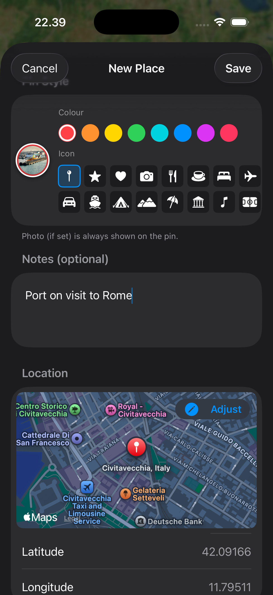

### Adjust the location

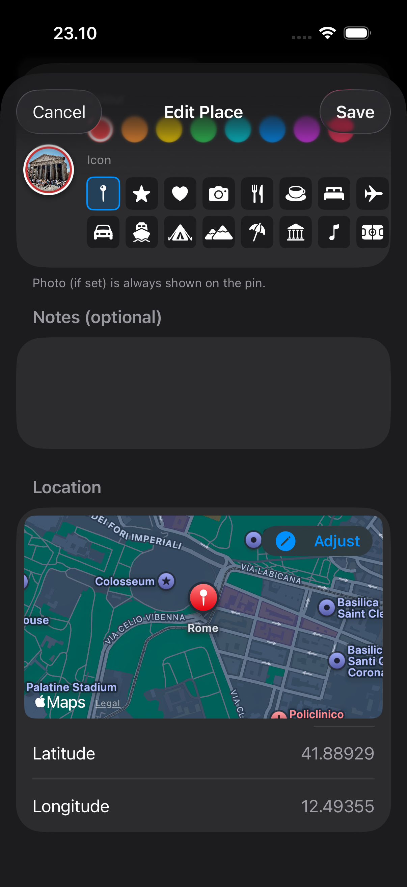

Tap **Adjust** below the location preview map. An orange crosshair appears — pan the map to the precise position, then tap **Use this location** to confirm.

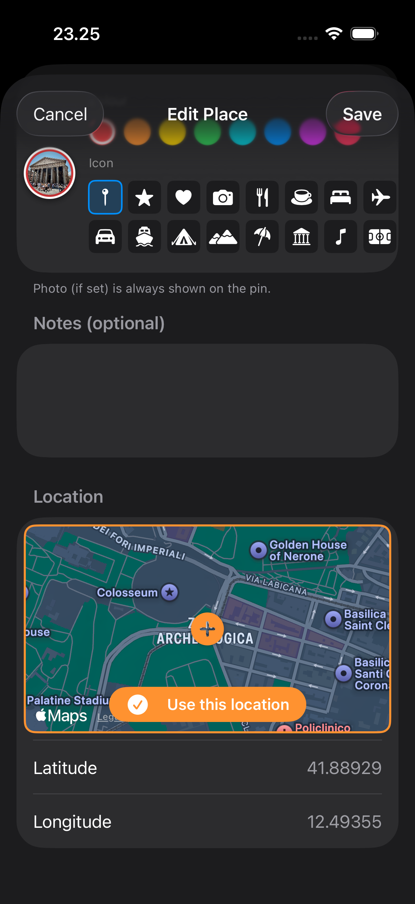

---

## 4. Place Detail

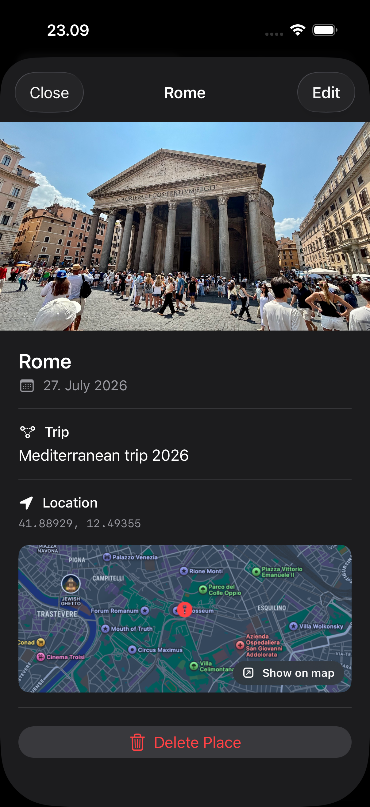

Tapping a place (from the map or the list) opens a detail sheet showing:

- Place name, date visited, and GPS coordinates
- **Trip** — the trip name this place belongs to (if one was set)
- A mini-map centred on the location — **tap the mini-map** to jump to that place on the main Map tab
- Notes (if any were added)
- A photo (if one was added)

Tap **Edit** to open the edit form, or **Delete Place** at the bottom to remove it.

When you close the detail sheet, the map automatically returns to the position and zoom level it had before you opened it.

---

## 5. Places Tab

The Places tab shows your saved places and trips. Use the **Places / Trips** segmented picker at the top of the list to switch between views.

### Places view

Each row shows the place name, city/country (if set), date, trip name (if set), and notes snippet.

### Trips view

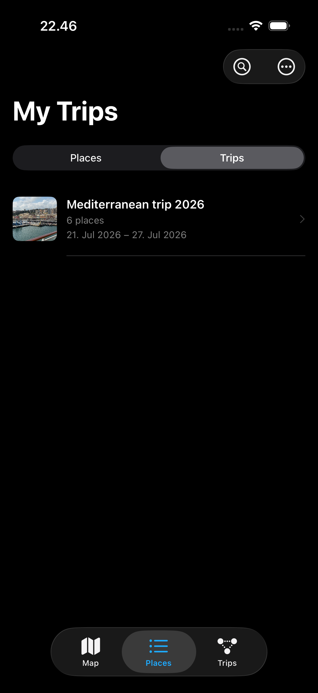

Shows all trips that have been named. Each row shows the trip name, number of places, and date range. Tap a trip to switch to the **Trips tab** and view it on the map.

**Swipe right** on a trip row to reveal a **Rename** button (orange):

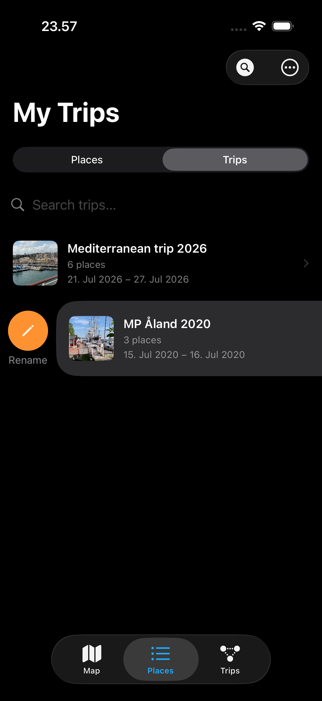

Tap **Rename** to open a prompt where you can type the new name:

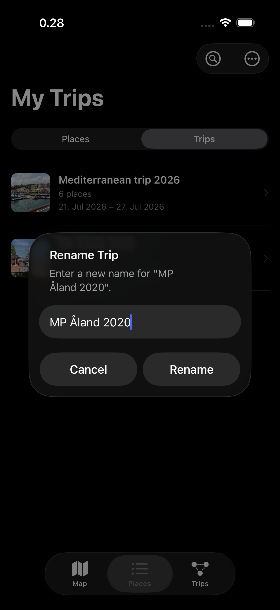

**Swipe left** to reveal a **Remove Trip** button (red) — this clears the trip name from all places in that trip without deleting the places themselves:

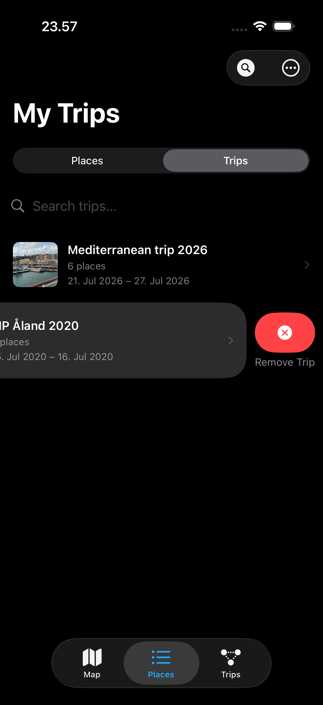

### Search the list

Tap the **🔍 search button** in the toolbar to reveal an inline search bar.

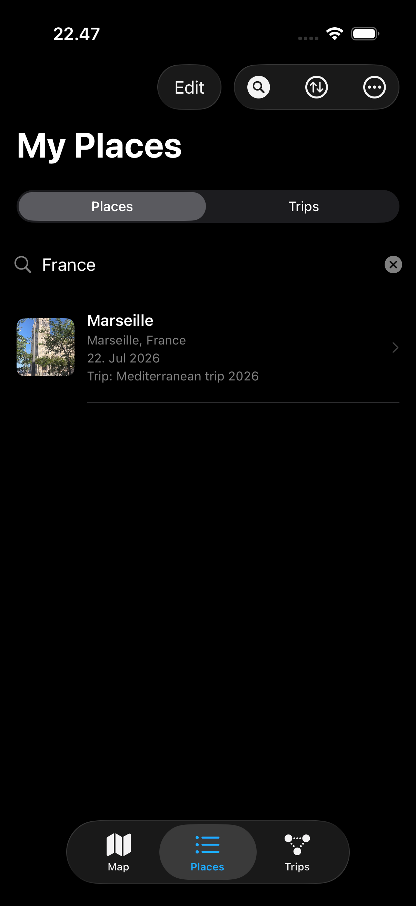

Type to filter — in Places view, searches by place name, city, country, trip name, or notes; in Trips view, searches by trip name. Tap the button again to hide the search bar and clear the filter.

### Sort the list

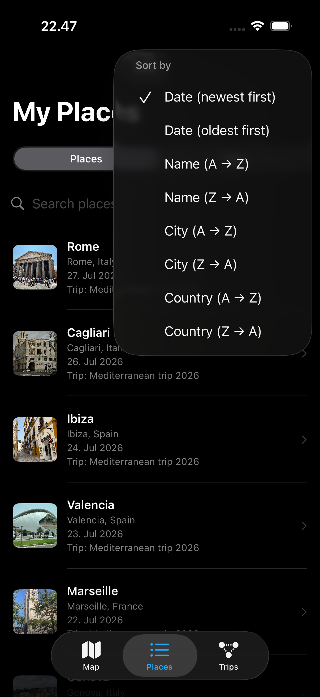

Tap the **sort button** (↑↓ circle icon) in the toolbar (Places view only) and choose from:
- **Date (newest first)** — default
- **Date (oldest first)**
- **Name (A → Z)**
- **Name (Z → A)**
- **City (A → Z)**
- **City (Z → A)**
- **Country (A → Z)**
- **Country (Z → A)**

### Delete a place
Swipe left on any row in Places view and tap **Delete**.

---

## 6. Trips Tab

The Trips tab lets you visualise a named trip as a route on a map — with orange lines connecting each stop in order, and directional arrows showing which way you travelled.

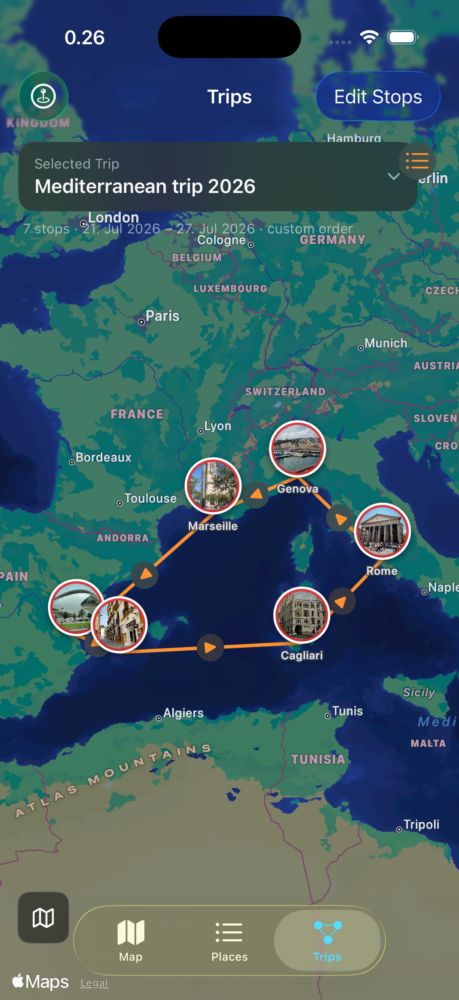

### Select a trip

A **trip picker card** appears at the top of the map. Tap it to open the trip list.

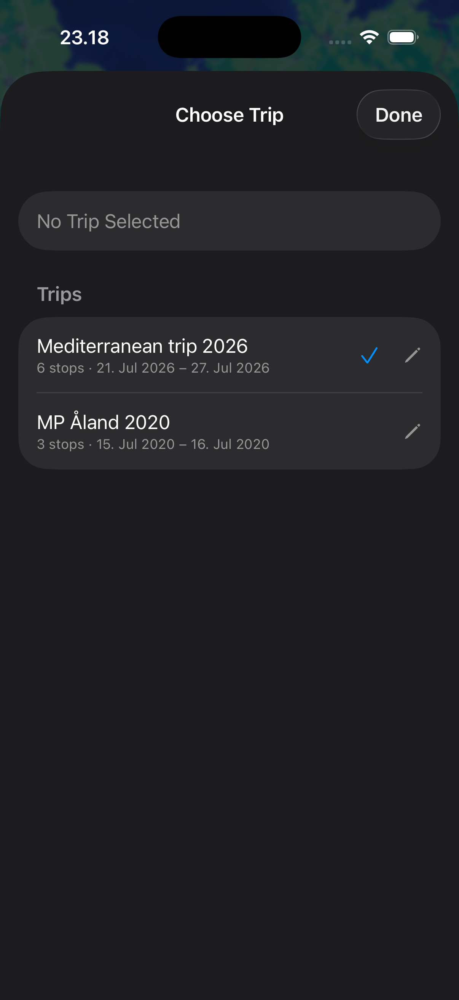

Tap a trip to select it and zoom the map to fit all its stops. A **checkmark** marks the currently selected trip. Tap **No Trip Selected** at the top to deselect.

To **rename** a trip, tap the **✎ pencil button** on the right side of any trip row — a prompt appears where you can type the new name. The rename is applied to all places that belong to that trip.

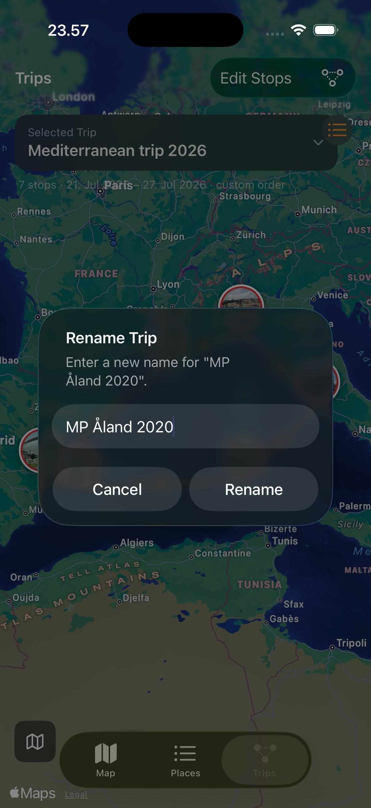

### Route lines

Each leg of the trip is drawn as an orange line with a directional arrow. When you travelled between two places in both directions (a back-and-forth leg), the two directions are shown as separate curved lines so both arrows are visible.

### Toolbar actions

When a trip is selected:

- **Top-left toolbar** — a **pin icon** (same as on the Map tab) zooms the map to fit all stops for the selected trip.
- **Top-right toolbar** — **Edit Stops** opens a sheet where you can set a custom stop order for the route (see below).

### Change the map style

The same **map style button** (bottom-left corner) is available here. Tap to switch between Standard, Hybrid, and Satellite. Your choice for the Trips tab is remembered separately from the Map tab.

### Tap a stop

Tap any place pin on the Trips map to open its detail sheet.

### Edit Stops

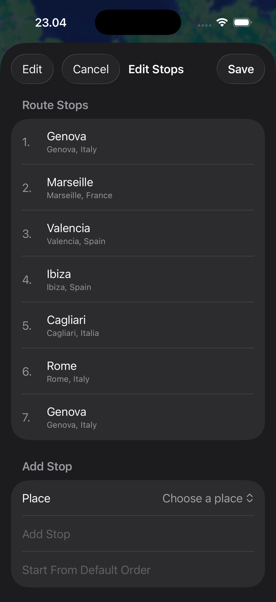

Tap **Edit Stops** to open a sheet that lets you control the order stops are connected:

1. Use the **Add Stop** section to pick a place from the trip and add it to the route.
2. Drag rows to reorder stops.
3. Swipe left on a stop to remove it from the custom order.
4. Tap **Start From Default Order** to pre-fill the list with all places sorted by date.
5. Tap **Save** to apply the custom order, or **Cancel** to discard changes.

When a custom order is active, the trip picker card shows **· custom order** next to the date range.

> **Tip:** To create a trip, open any place in **Edit** and fill in the **Trip Name** field. All places sharing the same trip name are grouped into that trip automatically.

---

## 7. The ••• Menu

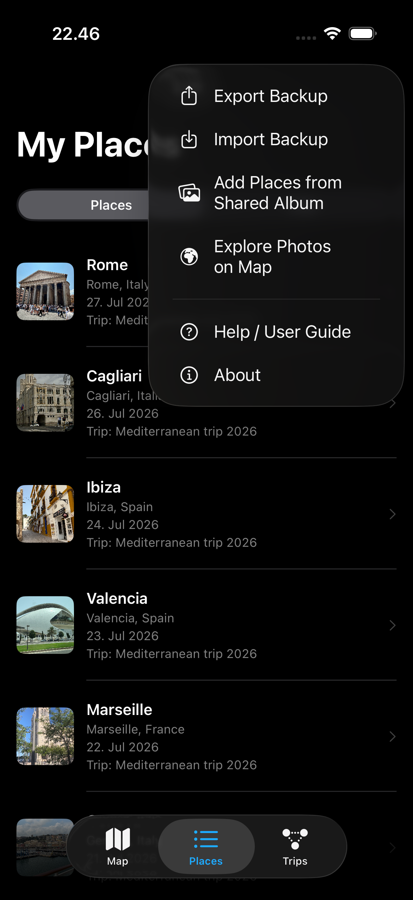

Tap  in the top-right toolbar of the Places tab to access:

- **Export Backup** — save all your places to a ZIP file
- **Import Backup** — restore from a ZIP backup
- **Add Places from Shared Album** — import places from an iCloud Shared Album
- **Explore Photos on Map** — browse your entire photo library on a map
- **Help / User Guide** — opens this guide in Safari
- **About** — shows app version, build date, and copyright information

---

## 8. Adding Places from Your Photos

There are two ways to bring in locations from your iOS photo library.

---

### 8.1 Add Places from Shared Album

Use this to import visited places from a specific iCloud Shared Album.

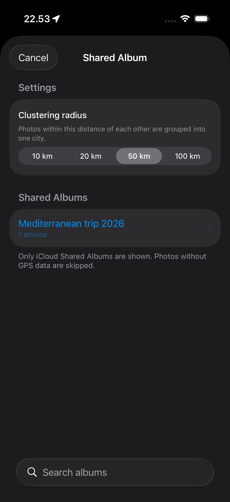

1. Tap ** → Add Places from Shared Album**.
2. The app asks for photo library access — tap **Allow**.
3. At the top, a **Settings** section lets you choose the **clustering radius** (see table below). Changing the radius rescans the selected album automatically.
4. Below settings, your iCloud Shared Albums are listed. Use the **search bar** to filter by album name. Tap the album you want to scan.
5. The app groups geotagged photos by geographic area and reverse-geocodes each group to a *City, Country* name. This takes a few seconds.

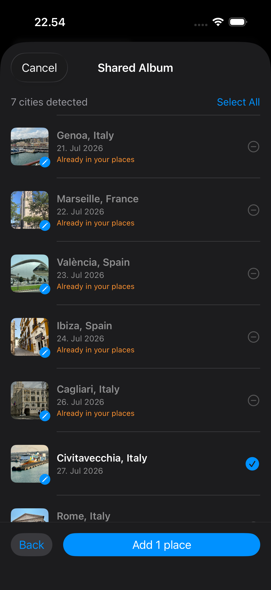

6. A list of detected locations appears. Locations you have already saved are marked **Already in your places** and cannot be selected again.
7. Tick any new locations you want to add, then tap **Add N places**.
8. To change the representative photo for a location, tap its thumbnail — a photo picker opens showing all photos from that area.

#### Clustering radius

| Radius | Best for |
|--------|----------|
| **10 km** | City breaks — keeps nearby neighbourhoods separate |
| **20 km** | Short regional trips |
| **50 km** | Default — works well for most holidays |
| **100 km** | Long road trips or wide country tours |

---

### 8.2 Explore Photos on Map

Use this to browse all geotagged photos from your entire photo library on a map and pick places to save.

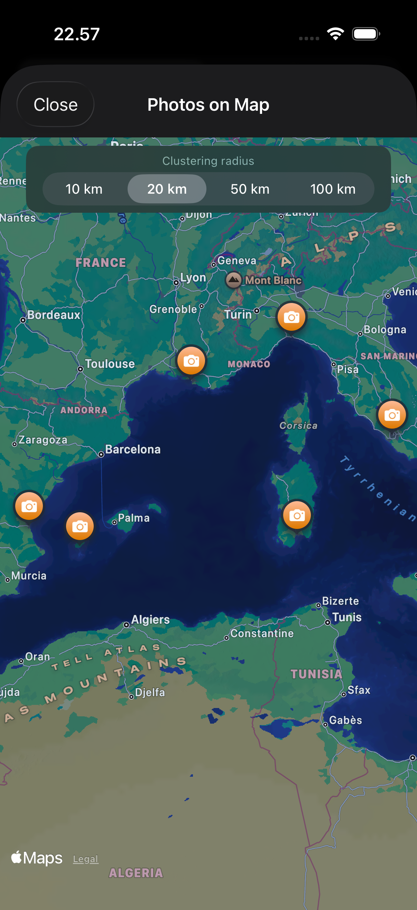

1. Tap ** → Explore Photos on Map**.
2. The app requests photo library access if not already granted.
3. The map appears almost immediately, showing **orange camera pins** — one per geographic area.
4. Use the **clustering radius picker** at the top of the map to control how photos are grouped — choose **10 km**, **20 km**, **50 km**, or **100 km**. Changing the radius rescans your library automatically and your choice is remembered for next time.
5. Tap any pin to open a detail sheet.

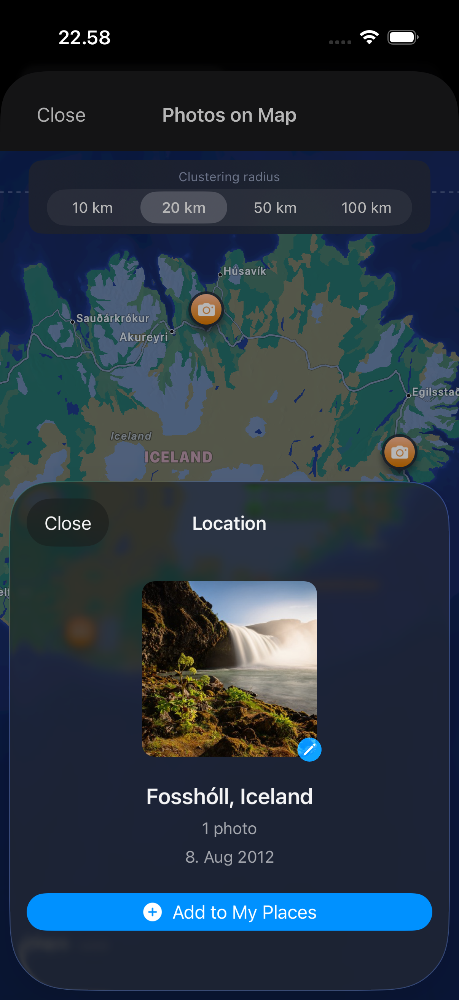

6. The detail sheet shows the location name, how many photos were taken there, the earliest date, and a thumbnail.
7. Tap the **thumbnail** to browse all photos from that area and choose a different one.
8. Tap **Add to My Places** to save the location. If the location is already in your places, the button is greyed out.

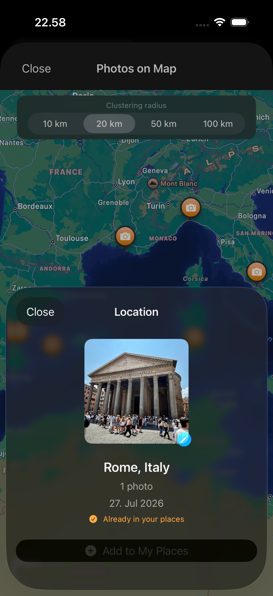

9. Tap **Close** (top-left) at any time to cancel and dismiss.

---

## 9. Backup & Restore

Back up all your places (including photos and trip data) to a single ZIP file you can store anywhere.

### Export a backup

1. Tap ** → Export Backup**.
2. The system Share Sheet appears. Save the ZIP to Files, send via AirDrop, email it, or store it anywhere you like.

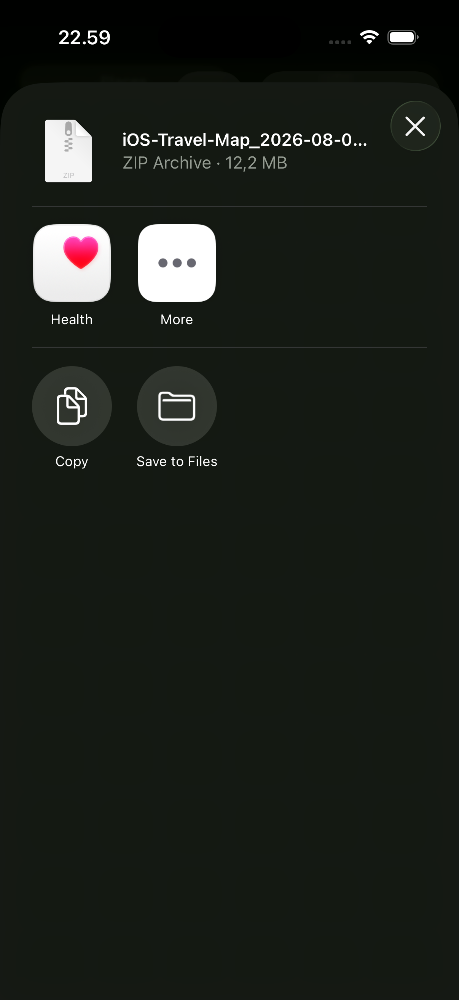

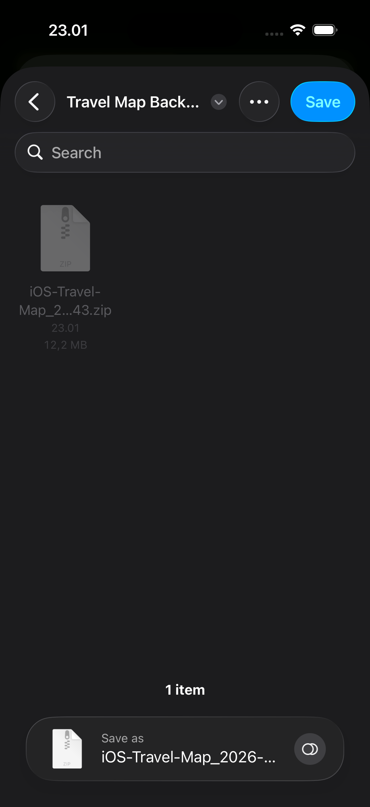

The backup file is named `iOS-Travel-Map_YYYY-MM-DD_HHmmss.zip`.

### Restore from a backup

1. Tap ** → Import Backup**.
2. Browse to your `.zip` backup file and tap it.

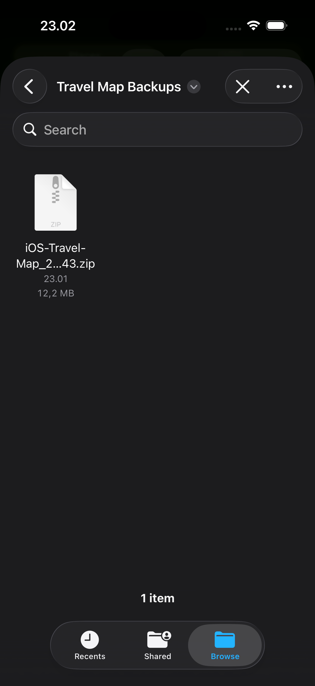

3. A dialog shows how many places were found in the backup. Choose:
   - **Replace All Data** — deletes everything currently in the app, then imports all places from the backup. Use this to fully restore.
   - **Add Missing Only** — keeps your existing places and only adds places not already present. Use this to merge two devices.
   - **Cancel** — cancels import without making any changes.

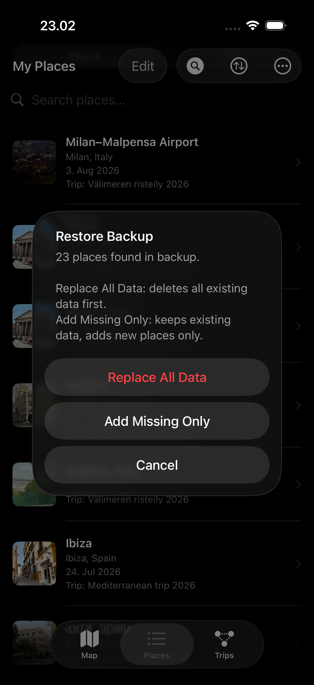

---

## 10. iCloud Sync

Your places sync automatically across all your Apple devices signed into the same iCloud account — iPhone, iPad, and Mac. No setup needed. Changes appear on other devices within a few seconds.

---

## 11. Tips

- **Organise by trip** — open any place in Edit and fill in the **Trip Name** field. Give the same name to all places from a trip and they'll appear together in the Trips tab as a route on the map.
- **Rename a trip** — in the Places tab Trips view, swipe left on a trip and tap **Rename**. Or in the Trips tab, tap the trip picker card and tap the **✎** next to any trip.
- **Remove a trip grouping** — in the Places tab Trips view, swipe right on a trip and tap **Remove Trip**. This clears the trip name from all its places without deleting them.
- **Large photo library?** Explore Photos on Map handles tens of thousands of photos — it clusters them into city-level pins so the map stays fast and easy to use. Adjust the clustering radius at the top of the map to control how broadly photos are grouped.
- **Same city, many photos?** Both import features cluster nearby photos into a single place entry. Use a smaller radius for dense city trips, larger for road trips.
- **Custom pins** — open any place in Edit to change its pin colour and icon. If you assign a photo to a place, the photo thumbnail is shown on the map instead.
- **Jump to a place on the map** — from the Places tab, tap a place to open its detail, then tap the mini-map to switch to the Map tab centred on that place. When you close the detail, the map returns to where you were.
- **Changed your mind about a photo?** Tap a saved place → Edit, then tap the photo thumbnail to pick a new one from your library.
- **Moved to a new phone?** Export a backup on the old phone, AirDrop the ZIP to the new phone, then Import Backup → Replace All Data. All your places, photos, pin styles, and trip data will be there.

---

## 12. About

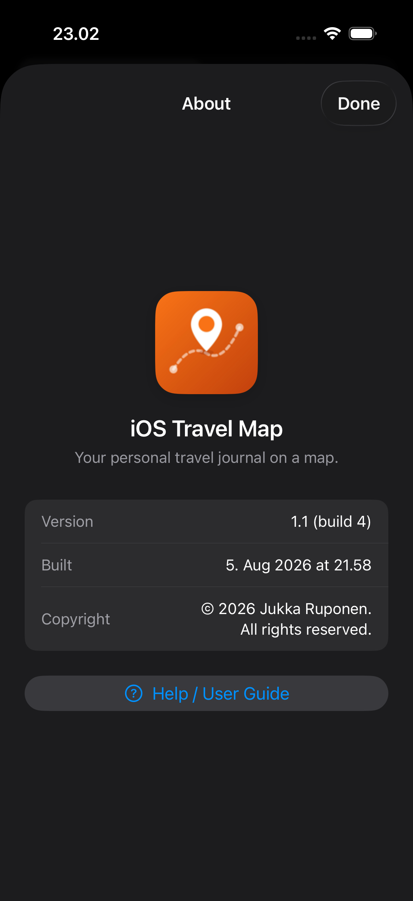

The About screen shows key information about this version of the app:

- **Version & build number** — e.g. *1.1 (build 3)*
- **Built** — the date and time this version was compiled
- **Copyright** — © 2026 Jukka Ruponen. All rights reserved.
- A **Help / User Guide** button linking to this guide

Access it via ** → About** in the Places tab.

---

© 2026 Jukka Ruponen. All rights reserved.
